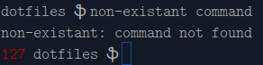
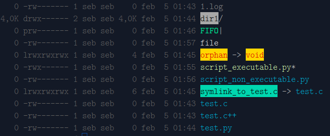

# Sebaste's dotfiles

A collection of dot files for Linux, where a unified approach has been taken for the shells CSH, TCSH, Bash and ZSH.

### Installation

1. Fill in all empty fields in the *configure* file.
 
 ```bash
 $EDITOR configure
 ```
2. Execute the *install.bash* file.
 
 ```bash
 ./install.bash
 ```

### Approach taken for the shells CSH, TCSH, Bash and ZSH

The idea has been to make as many things as possible common between these shells. The shared shell configuration data is contained within the directory *.shells.d/* and all the shell rc files have functionality in place to read the files herein.

#### Shell configuration

The start-up sequence is unified for all shells and consists of the following steps:

1. If the shell is not interactive, quit (the exception is ZSH, where this is not applicable for .zshrc).
2. Read and set the umask from *.shells.d/umask-i*.
3. Read and set the xkbmap from *.shells.d/xkbmap-s*.
4. Set the history file to ".history.[SHELL NAME]" (the exception is CSH, where ".history" will be used).
5. Read and set history size values for the history file and for the shell session from *.shells.d/history.size.file-i* and *.shells.d/history.size.session-i*.
6. Enable history file write serialization (the exception is CSH).
7. Source shell-specific options in *.[SHELL NAME].d/options*.
8. Source shell-specific completion options in *.[SHELL NAME].d/completions*.
9. Source the clean-up file in *.shells.d/*, which runs a series of "rm -rf ... >/dev/null" commands to remove certain directories silently. The directories stated here by default are directories created in the home directory automatically by invasive things like Firefox, GNOME, and Windows.
10. Source the local clean-up file in the installation directory. Here you can put a number of "rm -rf ... >/dev/null" commands to clean things up locally in the given environment.
11. Source the file *.[SHELL NAME].d/helpers* containing shell-specific helper functions to aid the shell further down along the road (the exception is CSH/TCSH, where functions do not exist - the helper file with helper functions has here been replaced with sourced scripts).
12. Export the BROWSER environment variable, based on the priority list in *.shells.d/env.browser-l*. The first found program in this list will be exported.
13. Export the PAGER environment variable, based on the priority list in *.shells.d/env.pager-l*. The first found program in this list will be exported.
14. Export the EDITOR environment variable, based on the priority list in *.shells.d/env.editor-l*. The first found program in this list will be exported.
15. Export the VISUAL environment variable to the value of the EDITOR environment variable.
16. Read and set general aliases from *.shells.d/aliases*.
17. If the given OS is Arch Linux, read and set Arch Linux-specific aliases from *.shells.d/aliases.archlinux*.
18. If the given OS is a Debian-based system (such as Debian or Ubuntu), read and set Debian-specific aliases from *.shells.d/aliases.debian*.
19. If the given computer is a laptop (as indicated by the battery), read and set laptop-specific aliases from *.shells.d/aliases.laptop*.
20. Source shell-specific aliases from *.[SHELL NAME].d/aliases*.
21. Read and set local aliases from *.local.shells.aliases*.
22. Export the home directory environment variables stated in *.shells.d/env.dirs.home*. This list should contain only environment variables of directories within the home directory.
23. Export the directory environment variables from *.shells.d/env.dirs*. This list should contain environment variables of directories outside the home directory.
24. Export grep-specific environment variables from *.shells.d/env.grep*.
25. Prefix the *.prgm/* directory to the PATH environment variable.
26. ZSH-only: create a hash-entry for the *.prgm/* directory.
27. Export local environment variables from *.local.shells.env*.
28. Get the terminal color support using tput.
29. If the terminal is "xterm" and the terminal color support is not 256 colors, attempt to enforce "xterm-256color" and keep this setting if this leads to a terminal color support of 256 colors.
30. If the terminal color support is 8 colors or more and if colordiff exists, alias diff to colordiff.
31. Get the charmap using locale.
32. Set the prompt.
    1. If the charmap is UTF-8, set the prompt user and root symbols (corresponding to the commonly used '$' or '#' at the right end) from *.shells.d/prompt.user.unicode-s* for user and *.shells.d/prompt.root.unicode-s* for root. Otherwise, set these symbols from *.shells.d/prompt.user-s* for user and *.shells.d/prompt.root-s* for root.
    2. For the given number of colors that the terminal supports, set the prompt error code color for this number, from the prompt error code file *.shells.d/prompt.errcode.[NUMBER OF COLORS]-s*. The supported colors are 256, 88, 8 and 0.
    3. Set the prompt to this format:
  "[Return code if this is not equal to 0 (status OK), printed in error code color] [ Current directory; one directory stated only] [ User/root symbol ] ".
  
  Example:
  
  

33. If the environment variable PAGER is set to "less", perform the following:
    1. If lesspipe exists, use it as a filter for viewing non-text files.
    2. If the charmap is UTF-8, set the environment variable LESSCHARSET to UTF-8.
    3. If the number of colors that the terminal supports is 256, export less termcap color escape sequences from *.shells.d/env.less.termcap.256*.
34. If the number of colors that the terminal supports is 256, evaluate the *.dir_colors* file in the target directory.
35. Unset all still existing variables and functions that are meant to be local to the shell configuration procedure.

### Dir colors

Example demonstrating the dircolors configuration:


